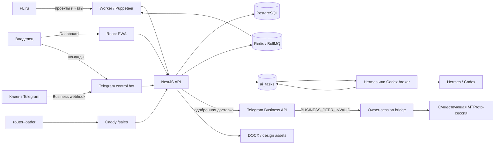
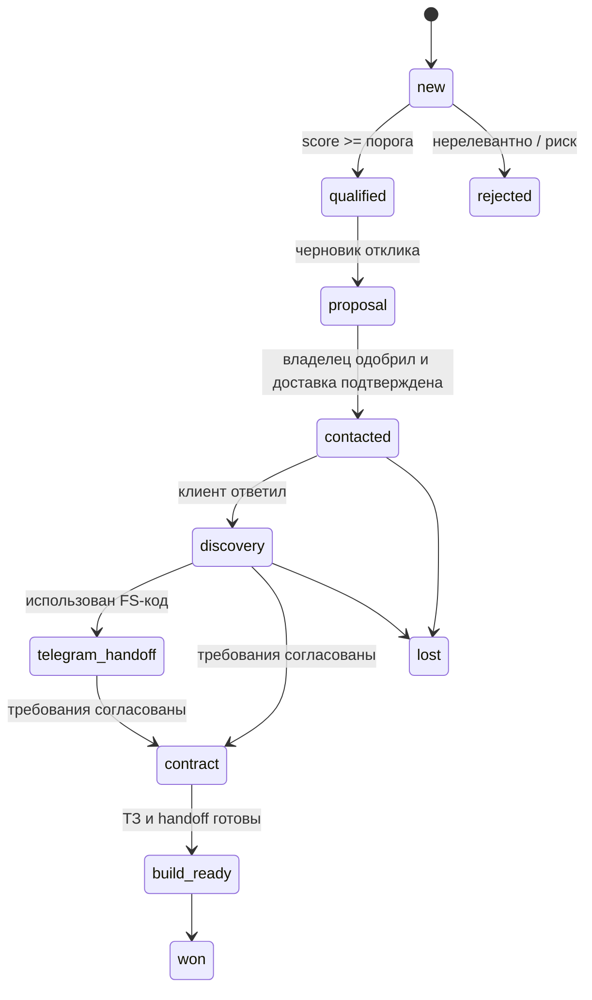

# Архитектура Freelance Sales

## Назначение и границы

Freelance Sales — локальная AI-система продаж для одного владельца. Она собирает
заказы FL.ru, оценивает их, готовит отклики, сохраняет переписку FL.ru и
Telegram, структурирует требования и формирует материалы для договора и
разработки. Внешнее сообщение является отдельной операцией доставки, а не
побочным эффектом генерации текста.

Система не является универсальным автономным Code Mesh-агентом. AI получает
ограниченный JSON-контекст и возвращает данные по заранее заданной схеме. У него
нет Docker socket, SSH-ключей, cookies FL.ru, произвольного shell или права
самостоятельно расширять список действий.

## Карта компонентов



### API и web

- `apps/api` — NestJS API, webhook Telegram, аутентификация, настройки,
  PostgreSQL, BullMQ, агент сделки, документы, дизайн и sandbox.
- `apps/web` — React PWA. Разделы: Dashboard, Полигон, Лаборатория общения,
  лиды, чаты, согласования и настройки.
- Один runtime image содержит собранные API и PWA. `api`, `worker` и
  `router-loader` запускают разные entrypoint из одного образа.

### Worker и FL.ru

Worker запускает периодические BullMQ-задачи. FL-коннектор использует сохранённую
авторизованную сессию и Chromium, сканирует ленту, вложения и чаты. Интервал
ленты задаётся `FL_SCAN_INTERVAL_SECONDS`; интервал чатов —
`FL_CHAT_SCAN_INTERVAL_SECONDS`. Входящие сообщения сохраняются идемпотентно по
идентификатору канала.

Новый подходящий заказ создаёт уведомление владельцу и может запустить анализ и
черновик, но не расходует отклик без ручного решения. Новое сообщение в FL-чате
делает предыдущий черновик устаревшим, уведомляет владельца и ставит подготовку
нового ответа в очередь.

### AI-брокер

API не вызывает модель напрямую для текстовых sales-задач. Он пишет запись в
`ai_tasks`, после чего один брокер:

1. забирает задачу через loopback internal API;
2. передаёт Hermes или Codex ограниченный `context.json`;
3. валидирует структурированный результат;
4. завершает или помечает задачу ошибкой;
5. поддерживает heartbeat коннектора.

Hermes и Codex используют одну очередь и не должны одновременно забирать
задачи. Приоритет выше у вопросов владельца и проверки черновиков. Потерянный
результат платной или внешней операции не повторяется вслепую.

## Жизненный цикл заказа



`lead` — каноническая сделка. Переход между каналами не создаёт второго клиента:
таблица `lead_channels` связывает FL-диалог, Telegram Business peer и другие
идентификаторы с одним `lead_id`.

## Анализ заказа и отклик

Анализ отделяет факты от допущений: вид проекта, намерение покупателя,
существующую систему, подтверждённый scope, неясности, риски, категорию цены и
рекомендуемые срок/стоимость. Нерелевантный маркетинг, контент и другие
неразработческие задачи должны быть помечены как `non_development`.

Генерация отклика проходит несколько этапов:

1. `draft_strategy` определяет цель, страх клиента, детали ТЗ, микро-план,
   критерий приёмки, релевантное доказательство и вопрос.
2. `draft_candidates` создаёт несколько принципиально разных вариантов.
3. `draft_review` выбирает и редактирует лучший вариант.
4. локальная проверка блокирует пересказ брифа, шаблонные заходы, несколько
   вопросов, выдуманные кейсы, заглушки, отсутствие цены/срока/старта и
   неподходящую длину.
5. после AI-переписывания локальная проверка выполняется повторно.

Явно указанная CMS или мобильная технология проходит отдельную проверку
`technology_fit`. Опыт подтверждается только публичным профилем продавца или
точным кейсом портфолио. При отсутствии доказательства черновик получает
повышенный риск и видимое предупреждение, а заявления об опыте блокируются.
Дата старта также не выводится из брифа: она берётся только из настройки
`seller_profile.available_from`; при пустом значении владелец видит флаг
`availability_missing`, а модель не вставляет шаблонную заглушку.

Используются профили `compact`, `standard`, `premium`, пять типов хука и пять
формулировок приёмки. Выбор детерминирован seed заказа, чтобы соседние отклики
не имели одинакового «AI-отпечатка». Имя клиента используется только когда оно
подтверждено профилем, а кейс — только из сохранённой библиотеки со ссылкой.
Полный чек-лист описан в [PROPOSALS.md](PROPOSALS.md).

## Агент общения

Агент ведёт разговор по восьми стадиям:

1. первый содержательный ответ;
2. discovery цели, текущего состояния, проблемы и ограничений;
3. квалификация ЛПР, дедлайна и критерия успеха;
4. ценность: диагноз, подход и кейс;
5. выбор канала или созвона при предметном интересе;
6. подтверждение scope, out-of-scope, приёмки и открытых вопросов;
7. коммерческие условия через владельца;
8. передача согласованной задачи в разработку.

До шести новых реплик клиента после последнего ответа объединяются в один
контекст. Обычный ответ ограничен 500 знаками, содержит не более одного вопроса
и сначала даёт полезный вывод. За весь discovery допускается не более семи
вопросов. Цена, срок, договор, гарантия, доступы, негатив, просьба о человеке и
другие стоп-темы требуют владельца.

Подробности Telegram-контура приведены в [TELEGRAM_AGENT.md](TELEGRAM_AGENT.md).

## Черновик, одобрение и доставка

```mermaid
sequenceDiagram
    participant C as Клиент
    participant A as API/Agent
    participant O as Владелец
    participant D as Delivery

    C->>A: новое сообщение
    A->>A: сохранить; stale старые drafts
    A->>O: уведомление
    A->>A: подготовить draft
    O->>A: одобрить / отправить
    A->>A: сверить получателя, hash и last_inbound_message_id
    alt контекст изменился
        A-->>O: draft stale, отправка заблокирована
    else контекст актуален
        A->>D: одна внешняя попытка
        D-->>A: sent / failed / send_unknown
        A-->>O: окончательный результат
    end
```

`outbound_deliveries` хранит idempotency key, хеш, число попыток, внешний ID и
результат. Если после сетевого обрыва нельзя доказать факт отправки, статус —
`send_unknown`, автоматический повтор запрещён. Это предотвращает дубли.

## Telegram Business и личная сессия

Основной маршрут — Telegram Business Bot API. Для чатов, куда Business API не
может ответить (`BUSINESS_PEER_INVALID`), отдельный opt-in bridge проверяет
одобренный хеш и пишет задание в `mtproto_outbox`. Уже существующая личная
MTProto-сессия владельца выполняет отправку. Новый Telegram-клиент на той же
сессии не открывается, чтобы не получить `AUTH_KEY_DUPLICATED`.

Bridge имеет дневной лимит и по умолчанию выключен без
`SALES_USERBOT_ENABLED=true`. После результата сторож API уведомляет владельца;
успех, ошибка и неопределённый статус формулируются по-разному.

## Документы и дизайн

- `specification` — Markdown-ТЗ с scope, out-of-scope и критериями приёмки.
- `contract_data` — только подтверждённые реквизиты и коммерческие поля.
- `contract` — DOCX из загруженного владельцем шаблона; неизвестные значения
  остаются пустыми/прочерками и требуют ручной проверки.
- `codex_handoff` — версия требований, тест-план и Definition of Done для
  разработки.
- design assets — до четырёх предварительных концепций по публичному reference;
  изображения доступны по HMAC-ссылкам с ограниченным сроком.

## Хранилища и основные таблицы

| Таблица | Назначение |
|---|---|
| `leads` | сделка, оценка, стадия, summary и readiness |
| `lead_channels` | внешние идентичности одной сделки |
| `messages` | неизменяемая хронология входящих/исходящих |
| `sales_requirements` | подтверждённые, открытые и предполагаемые требования |
| `agent_turns` | решение агента по каждой обработанной реплике |
| `drafts` | версии текстов и состояние согласования |
| `outbound_deliveries` | журнал внешней доставки и идемпотентность |
| `ai_tasks` | долговечная очередь Hermes/Codex |
| `documents` / `design_assets` | материалы сделки |
| `conversation_handoffs` | одноразовые FL → Telegram коды |
| `codex_handoffs` | версионированная передача в разработку |
| `owner_agent_sessions` | выбранный клиент и незавершённая команда владельца |
| `lead_missions` | сохранённые поручения по клиентам |
| `connector_state` / `scan_runs` | здоровье и история коннекторов |
| `activities` | аудит значимых действий |

PostgreSQL — источник истины. Redis используется как очередь и не заменяет
долговечные записи сделок или доставок.

## Предохранители и доверительные границы

- `STRICT_APPROVAL=true` запрещает автоматическую отправку рискованных ответов.
- `TELEGRAM_ON_DEMAND_ONLY=true` не позволяет входящему Telegram-сообщению само
  запустить генерацию, кроме нового live-сообщения клиента с активной адресной
  миссией; историческая синхронизация исключением не является.
- FL.ru имеет неотключаемый программный gate ручного одобрения даже при smart
  policy или активной миссии.
- Follow-up +1/+3/+7 — отложенная генерация черновика, а не отложенная отправка.
- `autonomy_class_stats` открывает только доказавший качество Telegram-класс;
  пороги и откат описаны в [RESEARCH_ROADMAP.md](RESEARCH_ROADMAP.md).
- Новое входящее сообщение делает старый черновик `stale`.
- Получатель сверяется по реальной identity, а не только по названию заказа.
- Вложения, страницы и клиентские сообщения считаются недоверенными данными;
  инструкции внутри них не выполняются.
- Секреты хранятся вне Git, а чувствительные настройки в БД шифруются
  AES-256-GCM.
- Internal API слушает loopback и требует отдельные broker/owner tokens.
- Sandbox-лиды изолированы и перехватывают внешние доставки.

## Ограниченная автономность

`lead_missions` и команды «общайся с …» включают автономные ответы только для
выбранного Telegram-клиента, только на новые live-сообщения и только пока не
сработал deadline или лимит ходов. Stop-темы и проблемы коннектора всегда
возвращают решение владельцу. Follow-up по расписанию по-прежнему создаёт
черновик и уведомление владельцу, но сам клиенту не отправляется. К существующим
данным добавлены `followup_schedule`, `autonomy_class_stats`,
`autonomy_feedback`, `agent_eval_results`, `quality_cases` и `lead_episodes`.
